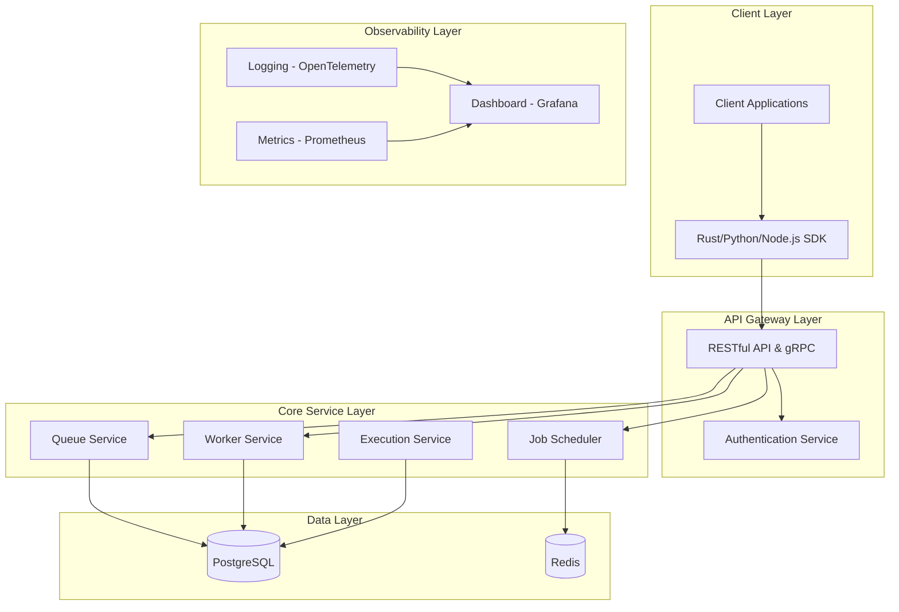

# Rancangan Arsitektur Sistem TaskForge

## 1. Gambaran Umum

TaskForge adalah platform SaaS background job queue yang dirancang untuk memberikan keandalan dan kinerja tinggi, khususnya untuk beban kerja kritis seperti fintech, e-commerce, dan pemrosesan data. Aplikasi ini dibangun menggunakan teknologi Rust untuk memanfaatkan jaminan keamanan memori dan konkurensi yang ditawarkan bahasa ini.

## 2. Tujuan dan Cakupan

### Tujuan
- Membangun sistem queue job yang dapat diandalkan dengan jaminan "Zero-Downtime, Zero-Memory-Leak"
- Menyediakan latensi ultra-rendah dan throughput tinggi (hingga ratusan ribu job per detik)
- Memberikan pengalaman pengembang yang luar biasa dengan API yang jelas dan dashboard observasi

### Cakupan
- Sistem manajemen job queue dan eksekusi job
- Sistem autentikasi dan otorisasi multi-tenant
- Dashboard monitoring dan observasi
- Sistem penjadwalan dan ketergantungan job
- Sistem logging dan metrik

## 3. Arsitektur Sistem

### 3.1. Arsitektur Tingkat Tinggi



### 3.2. Teknologi yang Digunakan

- **Backend**: Rust dengan framework Axum dan runtime Tokio
- **Database**: PostgreSQL untuk penyimpanan utama, Redis untuk caching dan pub/sub internal
- **Observability**: OpenTelemetry untuk tracing, Prometheus untuk metrics, Grafana untuk dashboard
- **Message Broker Internal**: Channel Tokio untuk komunikasi berperforma tinggi
- **Deployment**: Docker dan Kubernetes

## 4. Skema Database

Berdasarkan ERD dari PRD, berikut adalah skema database yang akan digunakan:

### 4.1. Tabel Organisasi dan Pengguna
```sql
-- Tabel Organisasi
CREATE TABLE organizations (
    id UUID PRIMARY KEY DEFAULT gen_random_uuid(),
    name VARCHAR(255) NOT NULL,
    billing_email VARCHAR(255) NOT NULL,
    created_at TIMESTAMP WITH TIME ZONE DEFAULT NOW()
);

-- Tabel Pengguna
CREATE TABLE users (
    id UUID PRIMARY KEY DEFAULT gen_random_uuid(),
    organization_id UUID REFERENCES organizations(id),
    email VARCHAR(255) NOT NULL UNIQUE,
    password_hash VARCHAR(255) NOT NULL,
    role VARCHAR(50) CHECK (role IN ('admin', 'member')),
    created_at TIMESTAMP WITH TIME ZONE DEFAULT NOW()
);

-- Tabel Subscription
CREATE TABLE subscriptions (
    id UUID PRIMARY KEY DEFAULT gen_random_uuid(),
    organization_id UUID REFERENCES organizations(id),
    tier VARCHAR(50) CHECK (tier IN ('starter', 'pro', 'enterprise')),
    limits JSONB,
    current_period_end TIMESTAMP WITH TIME ZONE
);
```

### 4.2. Tabel Proyek dan API Key
```sql
-- Tabel Proyek
CREATE TABLE projects (
    id UUID PRIMARY KEY DEFAULT gen_random_uuid(),
    organization_id UUID REFERENCES organizations(id),
    name VARCHAR(255) NOT NULL,
    description TEXT
);

-- Tabel API Key
CREATE TABLE api_keys (
    id UUID PRIMARY KEY DEFAULT gen_random_uuid(),
    project_id UUID REFERENCES projects(id),
    key_hash VARCHAR(255) NOT NULL,
    name VARCHAR(255) NOT NULL,
    permissions TEXT[],
    last_used_at TIMESTAMP WITH TIME ZONE,
    expires_at TIMESTAMP WITH TIME ZONE
);
```

### 4.3. Tabel Queue dan Job
```sql
-- Tabel Job Queue
CREATE TABLE job_queues (
    id UUID PRIMARY KEY DEFAULT gen_random_uuid(),
    project_id UUID REFERENCES projects(id),
    name VARCHAR(255) NOT NULL,
    priority INTEGER DEFAULT 0,
    settings JSONB
);

-- Tabel Job
CREATE TABLE jobs (
    id UUID PRIMARY KEY DEFAULT gen_random_uuid(),
    queue_id UUID REFERENCES job_queues(id),
    job_type VARCHAR(255) NOT NULL,
    payload JSONB,
    status VARCHAR(50) CHECK (status IN ('pending', 'scheduled', 'processing', 'succeeded', 'failed')) DEFAULT 'pending',
    priority INTEGER DEFAULT 0,
    scheduled_for TIMESTAMP WITH TIME ZONE,
    created_at TIMESTAMP WITH TIME ZONE DEFAULT NOW()
);

-- Indeks penting
CREATE INDEX idx_jobs_status_scheduled_priority ON jobs(status, scheduled_for, priority);
CREATE INDEX idx_jobs_queue_id ON jobs(queue_id);
```

### 4.4. Tabel Worker dan Eksekusi
```sql
-- Tabel Worker
CREATE TABLE workers (
    id UUID PRIMARY KEY DEFAULT gen_random_uuid(),
    project_id UUID REFERENCES projects(id),
    name VARCHAR(255) NOT NULL,
    type VARCHAR(50) CHECK (type IN ('general', 'specialized_cpu', 'specialized_io')),
    status VARCHAR(50) CHECK (status IN ('online', 'offline', 'draining')) DEFAULT 'offline',
    last_heartbeat TIMESTAMP WITH TIME ZONE
);

-- Tabel Assignment Queue-Worker
CREATE TABLE queue_worker_assignments (
    queue_id UUID REFERENCES job_queues(id),
    worker_id UUID REFERENCES workers(id),
    weight INTEGER DEFAULT 1,
    is_active BOOLEAN DEFAULT TRUE,
    PRIMARY KEY (queue_id, worker_id)
);

-- Tabel Eksekusi Job
CREATE TABLE job_executions (
    id UUID PRIMARY KEY DEFAULT gen_random_uuid(),
    job_id UUID REFERENCES jobs(id),
    worker_id UUID REFERENCES workers(id),
    status VARCHAR(50) CHECK (status IN ('started', 'succeeded', 'failed', 'retrying')),
    output TEXT,
    attempt_number INTEGER DEFAULT 1,
    started_at TIMESTAMP WITH TIME ZONE,
    finished_at TIMESTAMP WITH TIME ZONE
);

-- Indeks penting
CREATE INDEX idx_job_executions_job_id ON job_executions(job_id);

-- Tabel Log Eksekusi
CREATE TABLE execution_logs (
    id UUID PRIMARY KEY DEFAULT gen_random_uuid(),
    execution_id UUID REFERENCES job_executions(id),
    level VARCHAR(50) CHECK (level IN ('info', 'warn', 'error')),
    message TEXT,
    metadata JSONB,
    logged_at TIMESTAMP WITH TIME ZONE DEFAULT NOW()
);

-- Tabel Ketergantungan Job
CREATE TABLE job_dependencies (
    parent_job_id UUID REFERENCES jobs(id),
    child_job_id UUID REFERENCES jobs(id),
    PRIMARY KEY (parent_job_id, child_job_id)
);
```

## 5. Desain Arsitektur Internal

### 5.1. Arsitektur Service

#### Queue Service
- Bertanggung jawab atas manajemen antrian job
- Menyediakan endpoint untuk submit job baru
- Menyediakan mekanisme untuk mengambil job oleh worker
- Menangani prioritas dan penjadwalan job

#### Worker Service
- Mendaftarkan worker baru ke sistem
- Menyediakan mekanisme heartbeat untuk mengetahui status worker
- Menyediakan endpoint untuk drain mode
- Menangani assignment queue-worker

#### Execution Service
- Mengelola lifecycle eksekusi job
- Menyimpan hasil dan log eksekusi
- Menangani retry dengan backoff
- Menyediakan mekanisme untuk dead letter queue

#### Job Scheduler
- Menangani job yang dijadwalkan
- Menggunakan Redis untuk menyimpan informasi penjadwalan
- Menyediakan dukungan untuk ekspresi cron-like

### 5.2. Arsitektur Data dan Komunikasi

#### Database Connection Pool
- Menggunakan SQLx dengan connection pooling
- Menyediakan compile-time query checking
- Mendukung transaksi untuk operasi yang memerlukan konsistensi

#### Internal Communication
- Menggunakan channel Tokio untuk komunikasi antar komponen internal
- Menggunakan Redis pub/sub untuk komunikasi antar instance service
- Mengimplementasikan pattern async untuk menangani throughput tinggi

## 6. Desain Keamanan

### 6.1. Otentikasi dan Otorisasi
- Menggunakan JWT token untuk otentikasi
- Implementasi multi-tenant dengan isolasi per proyek
- Penggunaan API key dengan permission granular
- Pembatasan rate limit per proyek berdasarkan tier subscription

### 6.2. Enkripsi
- Enkripsi data dalam transit menggunakan TLS 1.3
- Enkripsi data sensitif di database menggunakan AES-256
- Tidak menyimpan password dalam bentuk plain text

## 7. Observability dan Monitoring

### 7.1. Logging
- Menggunakan OpenTelemetry untuk structured logging
- Menyediakan correlation ID untuk melacak request di seluruh sistem
- Mencatat semua aktivitas administratif untuk audit trail

### 7.2. Metrics
- Menggunakan Prometheus untuk mengumpulkan metrik kunci:
  - Panjang antrian
  - Tingkat penyelesaian job
  - Tingkat error
  - Jumlah worker aktif
  - Persentil latensi
- Menyediakan endpoint `/metrics` untuk scraping Prometheus

### 7.3. Dashboard
- Menggunakan Grafana untuk visualisasi metrik
- Menyediakan dashboard real-time untuk:
  - Status antrian
  - Status worker
  - Throughput (jobs/detik)
  - Latensi

## 8. Performa dan Skalabilitas

### 8.1. Optimasi Database
- Menggunakan indexing strategis pada kolom-kolom yang sering diquery
- Mempertimbangkan partisi tabel untuk data historis (Job dan JobExecution)
- Menggunakan prepared statements untuk mencegah SQL injection dan meningkatkan kinerja

### 8.2. Caching
- Menggunakan Redis untuk caching rate limit
- Menggunakan Redis untuk pub/sub event internal
- Menyediakan cache untuk informasi queue dan worker yang sering diakses

### 8.3. Konkurensi
- Menggunakan Tokio runtime untuk mendukung konkurensi async
- Mengimplementasikan worker pool untuk menangani eksekusi job
- Menggunakan channel Tokio untuk komunikasi antar komponen

## 9. Deployment dan Operasi

### 9.1. Containerization
- Menggunakan Docker untuk containerization
- Membuat Dockerfile multi-stage untuk optimasi ukuran image
- Menggunakan docker-compose untuk development environment

### 9.2. Orkestrasi
- Mendukung deployment di Kubernetes
- Dapat di-deploy di cloud provider (AWS/GCP/Azure)
- Dapat di-deploy di platform Rust-friendly seperti Fly.io

## 10. Roadmap Pengembangan

### Fase 1: Foundation (Minggu 1-2)
- Setup proyek Rust dengan Axum dan Tokio
- Implementasi skema database dasar
- Implementasi model data dan ORM mapping
- Implementasi sistem otentikasi dasar

### Fase 2: Core Functionality (Minggu 3-4)
- Implementasi queue dan job management
- Implementasi worker service
- Implementasi sistem eksekusi job
- Implementasi basic API endpoints

### Fase 3: Advanced Features (Minggu 5-6)
- Implementasi sistem penjadwalan job
- Implementasi ketergantungan antar job
- Implementasi retry mechanism dengan backoff
- Implementasi dead letter queue

### Fase 4: Observability dan Security (Minggu 7-8)
- Implementasi logging dan monitoring
- Implementasi sistem metrik (Prometheus)
- Implementasi security measures
- Implementasi dashboard observability

### Fase 5: Production Readiness (Minggu 9-10)
- Implementasi testing (unit, integration, E2E)
- Optimasi performa
- Pembuatan dokumentasi
- Pembuatan deployment guide