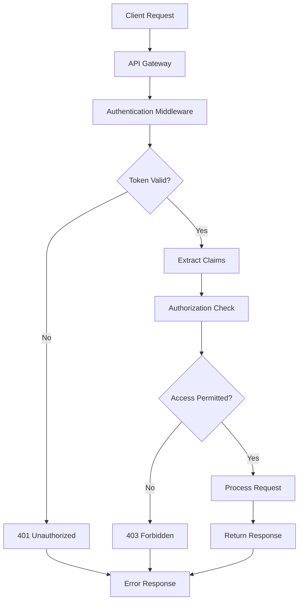

# Sistem Otentikasi dan Otorisasi Multi-Tenant untuk TaskForge

## 1. Gambaran Umum

Dokumen ini menjelaskan sistem otentikasi dan otorisasi untuk aplikasi TaskForge yang menerapkan arsitektur multi-tenant. Sistem ini dirancang untuk memastikan isolasi data antar organisasi dan memberikan kontrol akses yang granular terhadap sumber daya sistem.

## 2. Arsitektur Multi-Tenant

### 2.1. Model Isolasi Data

TaskForge menerapkan model isolasi data "Shared Database, Shared Schema" dengan kolom `organization_id` untuk memisahkan data antar tenant:

```
organizations table:
- id (UUID) - Primary tenant identifier
- name, billing_email, created_at

users table:
- id (UUID)
- organization_id (UUID) - Foreign key ke organizations
- email, password_hash, role
- Hanya dapat mengakses data dari organisasi yang sama

projects table:
- id (UUID)
- organization_id (UUID) - Harus cocok dengan pengguna yang mengakses
- name, description
```

### 2.2. Alur Otentikasi dan Otorisasi



## 3. Sistem Otentikasi

### 3.1. Implementasi JWT (JSON Web Token)

TaskForge menggunakan JWT untuk manajemen sesi yang stateless dan skalabel:

```rust
// File: src/auth/jwt.rs
use jsonwebtoken::{decode, encode, DecodingKey, EncodingKey, Header, Validation};
use serde::{Deserialize, Serialize};
use chrono::{Duration, Utc};
use uuid::Uuid;

#[derive(Debug, Serialize, Deserialize)]
pub struct Claims {
    pub sub: String,           // User ID
    pub org: String,           // Organization ID
    pub exp: i64,              // Expiration time
    pub iat: i64,              // Issued at time
    pub permissions: Vec<String>, // Permissions for the user
}

impl Claims {
    pub fn new(user_id: Uuid, organization_id: Uuid, permissions: Vec<String>, expiry_minutes: i64) -> Self {
        let now = Utc::now();
        let expiry = now + Duration::minutes(expiry_minutes);
        
        Self {
            sub: user_id.to_string(),
            org: organization_id.to_string(),
            exp: expiry.timestamp(),
            iat: now.timestamp(),
            permissions,
        }
    }
    
    pub fn is_expired(&self) -> bool {
        Utc::now().timestamp() > self.exp
    }
    
    pub fn has_permission(&self, permission: &str) -> bool {
        self.permissions.contains(&permission.to_string())
    }
}

pub struct JwtManager {
    encoding_key: EncodingKey,
    decoding_key: DecodingKey,
}

impl JwtManager {
    pub fn new(secret: &str) -> Self {
        Self {
            encoding_key: EncodingKey::from_secret(secret.as_ref()),
            decoding_key: DecodingKey::from_secret(secret.as_ref()),
        }
    }
    
    pub fn generate_token(&self, claims: Claims) -> Result<String, jsonwebtoken::errors::Error> {
        encode(&Header::default(), &claims, &self.encoding_key)
    }
    
    pub fn validate_token(&self, token: &str) -> Result<Claims, jsonwebtoken::errors::Error> {
        let mut validation = Validation::default();
        validation.validate_exp = true;
        validation.validate_iat = true;
        
        let token_data = decode::<Claims>(token, &self.decoding_key, &validation)?;
        Ok(token_data.claims)
    }
}
```

### 3.2. Sistem Login dan Registrasi

```rust
// File: src/auth/handlers.rs
use axum::{
    extract::{State, Json},
    http::StatusCode,
    response::IntoResponse,
};
use serde::{Deserialize, Serialize};
use crate::{
    auth::jwt::JwtManager,
    database::Database,
    models::{User, UserRole},
    utils::crypto,
};
use uuid::Uuid;

#[derive(Deserialize)]
pub struct LoginRequest {
    pub email: String,
    pub password: String,
}

#[derive(Serialize)]
pub struct LoginResponse {
    pub access_token: String,
    pub refresh_token: String,
    pub user_id: Uuid,
    pub organization_id: Uuid,
}

pub async fn login(
    State(db): State<Database>,
    State(jwt_manager): State<JwtManager>,
    Json(payload): Json<LoginRequest>,
) -> Result<impl IntoResponse, StatusCode> {
    // Ambil user dari database berdasarkan email
    let user = db.get_user_by_email(&payload.email)
        .await
        .map_err(|_| StatusCode::INTERNAL_SERVER_ERROR)?
        .ok_or(StatusCode::UNAUTHORIZED)?;

    // Verifikasi password
    if !crypto::verify_password(&payload.password, &user.password_hash) {
        return Err(StatusCode::UNAUTHORIZED);
    }

    // Generate claims untuk JWT
    let permissions = get_user_permissions(&user.role);
    let access_claims = Claims::new(
        user.id,
        user.organization_id,
        permissions.clone(),
        60, // 1 hour
    );
    
    let refresh_claims = Claims::new(
        user.id,
        user.organization_id,
        vec!["refresh".to_string()],
        10080, // 7 days
    );

    // Generate tokens
    let access_token = jwt_manager.generate_token(access_claims)
        .map_err(|_| StatusCode::INTERNAL_SERVER_ERROR)?;
    
    let refresh_token = jwt_manager.generate_token(refresh_claims)
        .map_err(|_| StatusCode::INTERNAL_SERVER_ERROR)?;

    Ok(Json(LoginResponse {
        access_token,
        refresh_token,
        user_id: user.id,
        organization_id: user.organization_id,
    }))
}

fn get_user_permissions(role: &UserRole) -> Vec<String> {
    match role {
        UserRole::Admin => vec![
            "organization:read".to_string(),
            "organization:write".to_string(),
            "project:read".to_string(),
            "project:write".to_string(),
            "queue:read".to_string(),
            "queue:write".to_string(),
            "job:read".to_string(),
            "job:write".to_string(),
            "worker:read".to_string(),
            "worker:write".to_string(),
        ],
        UserRole::Member => vec![
            "project:read".to_string(),
            "queue:read".to_string(),
            "job:read".to_string(),
            "job:write".to_string(), // Can submit jobs but not manage queues
        ],
    }
}
```

### 3.3. Middleware Otentikasi

```rust
// File: src/auth/middleware.rs
use axum::{
    extract::{Extension, RequestParts},
    http::{Request, StatusCode},
    middleware::Next,
    response::Response,
};
use std::sync::Arc;
use serde::Deserialize;
use crate::auth::jwt::{JwtManager, Claims};

pub struct AuthenticatedUser {
    pub user_id: uuid::Uuid,
    pub organization_id: uuid::Uuid,
    pub permissions: Vec<String>,
}

pub async fn auth_middleware(
    mut req: Request<axum::body::Body>,
    next: Next,
) -> Result<Response, StatusCode> {
    // Ambil token dari header Authorization
    let auth_header = req.headers()
        .get("authorization")
        .and_then(|header| header.to_str().ok())
        .ok_or(StatusCode::UNAUTHORIZED)?;
    
    let token = auth_header
        .strip_prefix("Bearer ")
        .ok_or(StatusCode::UNAUTHORIZED)?
        .trim();
    
    // Validasi token
    let jwt_manager = req.extensions()
        .get::<Arc<JwtManager>>()
        .ok_or(StatusCode::INTERNAL_SERVER_ERROR)?;
    
    let claims = jwt_manager.validate_token(token)
        .map_err(|_| StatusCode::UNAUTHORIZED)?;
    
    // Periksa apakah token sudah kadaluarsa
    if claims.is_expired() {
        return Err(StatusCode::UNAUTHORIZED);
    }
    
    // Tambahkan informasi user ke request extensions
    let user = AuthenticatedUser {
        user_id: uuid::Uuid::parse_str(&claims.sub)
            .map_err(|_| StatusCode::INTERNAL_SERVER_ERROR)?,
        organization_id: uuid::Uuid::parse_str(&claims.org)
            .map_err(|_| StatusCode::INTERNAL_SERVER_ERROR)?,
        permissions: claims.permissions,
    };
    
    req.extensions_mut().insert(user);
    
    Ok(next.run(req).await)
}

// Fungsi untuk memeriksa izin
pub fn check_permission(user: &AuthenticatedUser, required_permission: &str) -> bool {
    user.permissions.contains(&required_permission.to_string())
}
```

## 4. Sistem Otorisasi Multi-Tenant

### 4.1. Prinsip Isolasi Tenant

Setiap permintaan harus diverifikasi bahwa pengguna hanya mengakses sumber daya yang dimiliki oleh organisasinya:

```rust
// File: src/auth/tenant.rs
use uuid::Uuid;
use crate::auth::middleware::AuthenticatedUser;

pub struct TenantChecker;

impl TenantChecker {
    // Memeriksa apakah user memiliki akses ke organisasi tertentu
    pub fn user_belongs_to_organization(
        user: &AuthenticatedUser,
        organization_id: Uuid,
    ) -> bool {
        user.organization_id == organization_id
    }
    
    // Memeriksa apakah user memiliki akses ke proyek tertentu
    pub async fn user_can_access_project(
        &self,
        user: &AuthenticatedUser,
        project_id: Uuid,
        db: &Database,
    ) -> Result<bool, sqlx::Error> {
        let project = db.get_project_by_id(project_id).await?;
        match project {
            Some(project) => Ok(user.organization_id == project.organization_id),
            None => Ok(false),
        }
    }
    
    // Memeriksa apakah user memiliki akses ke antrian tertentu
    pub async fn user_can_access_queue(
        &self,
        user: &AuthenticatedUser,
        queue_id: Uuid,
        db: &Database,
    ) -> Result<bool, sqlx::Error> {
        let queue = db.get_job_queue_by_id(queue_id).await?;
        match queue {
            Some(queue) => Ok(user.organization_id == queue.project_id),
            None => Ok(false),
        }
    }
    
    // Memeriksa apakah user memiliki akses ke job tertentu
    pub async fn user_can_access_job(
        &self,
        user: &AuthenticatedUser,
        job_id: Uuid,
        db: &Database,
    ) -> Result<bool, sqlx::Error> {
        let job = db.get_job_by_id(job_id).await?;
        match job {
            Some(job) => {
                // Ambil informasi queue dari job
                let queue = db.get_job_queue_by_id(job.queue_id).await?;
                match queue {
                    Some(queue) => Ok(user.organization_id == queue.project_id),
                    None => Ok(false),
                }
            }
            None => Ok(false),
        }
    }
}
```

### 4.2. Implementasi Otorisasi pada Handler

```rust
// File: src/handlers/job_handler.rs
use axum::{
    extract::{State, Path, Json},
    http::StatusCode,
    response::IntoResponse,
};
use serde::Deserialize;
use crate::{
    auth::middleware::{AuthenticatedUser, check_permission},
    auth::tenant::TenantChecker,
    database::Database,
    models::Job,
};

#[derive(Deserialize)]
pub struct CreateJobRequest {
    pub queue_name: String,
    pub job_type: String,
    pub payload: serde_json::Value,
    pub priority: Option<i32>,
}

pub async fn create_job(
    State(db): State<Database>,
    authenticated_user: AuthenticatedUser, // Extracted from middleware
    Json(payload): Json<CreateJobRequest>,
) -> Result<impl IntoResponse, StatusCode> {
    // Periksa izin
    if !check_permission(&authenticated_user, "job:write") {
        return Err(StatusCode::FORBIDDEN);
    }
    
    // Ambil queue berdasarkan nama dan organisasi user
    let queue = db.get_queue_by_name_and_org(
        &payload.queue_name,
        authenticated_user.organization_id,
    ).await
    .map_err(|_| StatusCode::INTERNAL_SERVER_ERROR)?
    .ok_or(StatusCode::NOT_FOUND)?;
    
    // Buat job
    let job = Job::new(
        queue.id,
        payload.job_type,
        payload.payload,
        payload.priority.unwrap_or(0),
    );
    
    let created_job = db.create_job(job).await
        .map_err(|_| StatusCode::INTERNAL_SERVER_ERROR)?;
    
    Ok(Json(created_job))
}

pub async fn get_job(
    State(db): State<Database>,
    authenticated_user: AuthenticatedUser,
    Path(job_id): Path<uuid::Uuid>,
) -> Result<impl IntoResponse, StatusCode> {
    // Periksa izin
    if !check_permission(&authenticated_user, "job:read") {
        return Err(StatusCode::FORBIDDEN);
    }
    
    // Periksa apakah user dapat mengakses job ini
    let tenant_checker = TenantChecker;
    if !tenant_checker.user_can_access_job(&authenticated_user, job_id, &db).await
        .map_err(|_| StatusCode::INTERNAL_SERVER_ERROR)? {
        return Err(StatusCode::FORBIDDEN);
    }
    
    let job = db.get_job_by_id(job_id).await
        .map_err(|_| StatusCode::INTERNAL_SERVER_ERROR)?
        .ok_or(StatusCode::NOT_FOUND)?;
    
    Ok(Json(job))
}
```

## 5. Sistem API Key

### 5.1. Manajemen API Key

TaskForge menyediakan sistem API key untuk otentikasi dari aplikasi eksternal:

```rust
// File: src/auth/api_key.rs
use serde::{Deserialize, Serialize};
use uuid::Uuid;
use chrono::{DateTime, Utc};
use crate::utils::crypto;

#[derive(Debug, Clone, Serialize, Deserialize)]
pub struct ApiKey {
    pub id: Uuid,
    pub project_id: Uuid,
    pub key_hash: String,      // Hash dari API key
    pub name: String,
    pub permissions: Vec<String>,
    pub last_used_at: Option<DateTime<Utc>>,
    pub expires_at: Option<DateTime<Utc>>,
    pub created_at: DateTime<Utc>,
}

impl ApiKey {
    pub fn new(project_id: Uuid, name: String, permissions: Vec<String>) -> (Self, String) {
        // Generate API key acak
        let raw_key = format!("tf_{}", crypto::generate_random_string(32));
        let key_hash = crypto::hash_api_key(&raw_key);
        
        let api_key = Self {
            id: Uuid::new_v4(),
            project_id,
            key_hash,
            name,
            permissions,
            last_used_at: None,
            expires_at: None,
            created_at: Utc::now(),
        };
        
        (api_key, raw_key)
    }
    
    pub fn is_valid(&self) -> bool {
        if let Some(expires_at) = self.expires_at {
            return Utc::now() < expires_at;
        }
        true
    }
    
    pub fn has_permission(&self, permission: &str) -> bool {
        self.permissions.contains(&permission.to_string())
    }
}

pub struct ApiKeyAuthenticator;

impl ApiKeyAuthenticator {
    pub async fn authenticate(
        &self,
        api_key: &str,
        db: &Database,
    ) -> Result<Option<AuthenticatedUser>, sqlx::Error> {
        let key_hash = crypto::hash_api_key(api_key);
        
        let api_key_record = db.get_api_key_by_hash(&key_hash).await?;
        
        match api_key_record {
            Some(key) => {
                if !key.is_valid() {
                    return Ok(None);
                }
                
                // Update last_used_at
                db.update_api_key_last_used(key.id).await?;
                
                // Dapatkan project dan organisasi
                let project = db.get_project_by_id(key.project_id).await?
                    .ok_or(sqlx::Error::RowNotFound)?;
                
                Ok(Some(AuthenticatedUser {
                    user_id: key.id, // Use API key ID as user ID for API key auth
                    organization_id: project.organization_id,
                    permissions: key.permissions,
                }))
            }
            None => Ok(None),
        }
    }
}
```

### 5.2. Middleware API Key

```rust
// File: src/auth/api_key_middleware.rs
use axum::{
    extract::Request,
    middleware::Next,
    response::Response,
};
use http::StatusCode;

pub async fn api_key_middleware(
    mut req: Request<axum::body::Body>,
    next: Next,
) -> Result<Response, StatusCode> {
    // Cek apakah permintaan memiliki header Authorization
    let auth_header = req.headers()
        .get("authorization")
        .and_then(|header| header.to_str().ok());
    
    if let Some(auth_header) = auth_header {
        if let Some(api_key) = auth_header.strip_prefix("Bearer ").or_else(|| 
            auth_header.strip_prefix("API-Key ")
        ) {
            let api_key_auth = req.extensions()
                .get::<std::sync::Arc<ApiKeyAuthenticator>>()
                .ok_or(StatusCode::INTERNAL_SERVER_ERROR)?;
            
            let db = req.extensions()
                .get::<std::sync::Arc<Database>>()
                .ok_or(StatusCode::INTERNAL_SERVER_ERROR)?;
            
            let user = api_key_auth.authenticate(api_key.trim(), db.as_ref()).await
                .map_err(|_| StatusCode::INTERNAL_SERVER_ERROR)?;
            
            if let Some(user) = user {
                req.extensions_mut().insert(user);
                return Ok(next.run(req).await);
            }
        }
    }
    
    // Jika tidak ada API key yang valid, lanjutkan ke middleware otentikasi lainnya
    Ok(next.run(req).await)
}
```

## 6. Role-Based Access Control (RBAC)

### 6.1. Definisi Role dan Permission

TaskForge menerapkan sistem RBAC dengan role dan permission berikut:

#### Role
- **Admin**: Akses penuh ke semua fitur dalam organisasi
- **Member**: Akses terbatas, biasanya hanya untuk job submission dan monitoring dasar

#### Permission
- `organization:read` - Membaca informasi organisasi
- `organization:write` - Mengelola organisasi
- `project:read` - Membaca proyek
- `project:write` - Mengelola proyek
- `queue:read` - Membaca antrian
- `queue:write` - Mengelola antrian
- `job:read` - Membaca job
- `job:write` - Submit dan mengelola job
- `worker:read` - Membaca status worker
- `worker:write` - Mengelola worker

### 6.2. Sistem Permission Dinamis

```rust
// File: src/auth/permission.rs
use std::collections::HashMap;
use uuid::Uuid;

pub struct PermissionManager {
    // Cache permission untuk efisiensi
    permission_cache: std::sync::RwLock<HashMap<String, Vec<String>>>,
}

impl PermissionManager {
    pub fn new() -> Self {
        Self {
            permission_cache: std::sync::RwLock::new(HashMap::new()),
        }
    }
    
    pub async fn get_user_permissions(
        &self,
        user_id: Uuid,
        db: &Database,
    ) -> Result<Vec<String>, sqlx::Error> {
        // Cek cache dulu
        let cache_key = user_id.to_string();
        {
            let cache = self.permission_cache.read().unwrap();
            if let Some(permissions) = cache.get(&cache_key) {
                return Ok(permissions.clone());
            }
        }
        
        // Ambil dari database
        let user = db.get_user_by_id(user_id).await?
            .ok_or(sqlx::Error::RowNotFound)?;
        
        let permissions = self.get_permissions_for_role(&user.role);
        
        // Simpan ke cache
        {
            let mut cache = self.permission_cache.write().unwrap();
            cache.insert(cache_key, permissions.clone());
        }
        
        Ok(permissions)
    }
    
    fn get_permissions_for_role(&self, role: &UserRole) -> Vec<String> {
        match role {
            UserRole::Admin => vec![
                "organization:read".to_string(),
                "organization:write".to_string(),
                "project:read".to_string(),
                "project:write".to_string(),
                "queue:read".to_string(),
                "queue:write".to_string(),
                "job:read".to_string(),
                "job:write".to_string(),
                "worker:read".to_string(),
                "worker:write".to_string(),
            ],
            UserRole::Member => vec![
                "project:read".to_string(),
                "queue:read".to_string(),
                "job:read".to_string(),
                "job:write".to_string(),
            ],
        }
    }
    
    pub fn invalidate_user_cache(&self, user_id: Uuid) {
        let cache_key = user_id.to_string();
        let mut cache = self.permission_cache.write().unwrap();
        cache.remove(&cache_key);
    }
}
```

## 7. Keamanan Tambahan

### 7.1. Rate Limiting Berbasis Tenant

```rust
// File: src/auth/rate_limiter.rs
use std::collections::HashMap;
use std::sync::Arc;
use std::time::{Duration, Instant};
use tokio::sync::RwLock;
use uuid::Uuid;

pub struct TenantRateLimiter {
    // Rate limits per tenant (organization)
    limits: Arc<RwLock<HashMap<Uuid, Vec<RequestRecord>>>>,
    // Default rate limit: 1000 requests per hour
    default_requests_per_hour: u32,
}

struct RequestRecord {
    timestamp: Instant,
    endpoint: String,
}

impl TenantRateLimiter {
    pub fn new(default_requests_per_hour: u32) -> Self {
        Self {
            limits: Arc::new(RwLock::new(HashMap::new())),
            default_requests_per_hour,
        }
    }
    
    pub async fn is_allowed(
        &self,
        organization_id: Uuid,
        endpoint: &str,
        max_requests: Option<u32>,
    ) -> bool {
        let now = Instant::now();
        let max_requests = max_requests.unwrap_or(self.default_requests_per_hour);
        
        let mut limits = self.limits.write().await;
        let records = limits.entry(organization_id).or_insert_with(Vec::new);
        
        // Hapus request lama (lebih dari 1 jam)
        records.retain(|record| {
            now.duration_since(record.timestamp) < Duration::from_secs(3600)
        });
        
        // Periksa apakah jumlah request melebihi batas
        if records.len() >= max_requests as usize {
            return false;
        }
        
        // Tambahkan request baru
        records.push(RequestRecord {
            timestamp: now,
            endpoint: endpoint.to_string(),
        });
        
        true
    }
}
```

### 7.2. Audit Log untuk Akses

```rust
// File: src/auth/audit.rs
use serde_json::Value;
use uuid::Uuid;
use chrono::{DateTime, Utc};
use crate::database::Database;

pub struct AuditLogger {
    db: Database,
}

impl AuditLogger {
    pub fn new(db: Database) -> Self {
        Self { db }
    }
    
    pub async fn log_access(
        &self,
        user_id: Uuid,
        organization_id: Uuid,
        action: &str,
        resource_type: &str,
        resource_id: Option<Uuid>,
        metadata: Option<Value>,
    ) -> Result<(), sqlx::Error> {
        let audit_entry = AuditEntry {
            id: Uuid::new_v4(),
            user_id,
            organization_id,
            action: action.to_string(),
            resource_type: resource_type.to_string(),
            resource_id,
            metadata: metadata.unwrap_or(serde_json::Value::Null),
            timestamp: Utc::now(),
        };
        
        self.db.insert_audit_log(audit_entry).await?;
        Ok(())
    }
}

pub struct AuditEntry {
    pub id: Uuid,
    pub user_id: Uuid,
    pub organization_id: Uuid,
    pub action: String,
    pub resource_type: String,
    pub resource_id: Option<Uuid>,
    pub metadata: Value,
    pub timestamp: DateTime<Utc>,
}
```

## 8. Best Practices dan Rekomendasi

### 8.1. Praktik Keamanan Terbaik

1. **Gunakan HTTPS secara ketat**: Semua komunikasi harus dienkripsi
2. **Rotasi secret secara berkala**: Ganti JWT secret dan API key secara berkala
3. **Validasi input secara menyeluruh**: Cegah serangan injection
4. **Gunakan rate limiting**: Lindungi dari serangan denial-of-service
5. **Log semua akses penting**: Untuk keperluan audit dan forensik

### 8.2. Pertimbangan Kinerja

1. **Cache informasi otentikasi**: Gunakan Redis atau in-memory cache
2. **Gunakan connection pooling**: Untuk database dan layanan eksternal
3. **Optimalkan query database**: Gunakan indeks yang sesuai
4. **Gunakan async secara efektif**: Untuk menangani banyak permintaan sekaligus

### 8.3. Pengujian dan Validasi

1. **Uji penetrasi secara berkala**: Untuk mengidentifikasi kerentanan
2. **Audit keamanan kode**: Gunakan alat analisis statis
3. **Uji skenario multi-tenant**: Pastikan data tidak bocor antar tenant
4. **Uji beban untuk sistem otentikasi**: Pastikan sistem tetap responsif saat sibuk