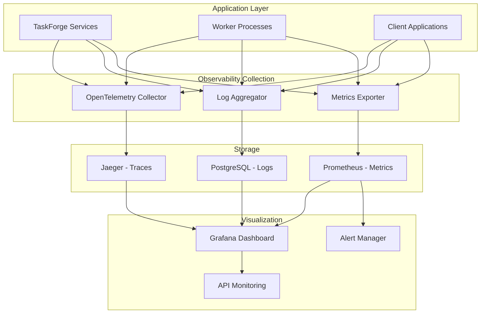

# Dashboard Observability untuk TaskForge

## 1. Gambaran Umum

Dokumen ini menjelaskan sistem dashboard dan observability untuk aplikasi TaskForge. Sistem ini menyediakan antarmuka visual untuk memantau kesehatan, kinerja, dan penggunaan sistem secara real-time dan historis.

## 2. Arsitektur Observability

### 2.1. Komponen Utama Observability

Sistem observability TaskForge terdiri dari tiga komponen utama:

1. **Logging**: Pencatatan event dan aktivitas sistem
2. **Metrics**: Pengumpulan dan ekspor data kuantitatif
3. **Tracing**: Pelacakan request end-to-end melalui sistem

### 2.2. Arsitektur Observability Stack



## 3. Dashboard Metrics dan Monitoring

### 3.1. Dashboard System Health

```rust
// File: src/dashboard/system_health.rs
use serde::{Deserialize, Serialize};
use chrono::{DateTime, Utc};

#[derive(Debug, Clone, Serialize, Deserialize)]
pub struct SystemHealthMetrics {
    pub timestamp: DateTime<Utc>,
    pub cpu_usage: f64,                    // Persentase penggunaan CPU
    pub memory_usage: f64,                 // Persentase penggunaan memori
    pub disk_usage: f64,                   // Persentase penggunaan disk
    pub network_in: f64,                   // Jumlah data masuk (bytes/s)
    pub network_out: f64,                  // Jumlah data keluar (bytes/s)
    pub database_connections: u32,         // Jumlah koneksi database aktif
    pub database_queue_length: u32,        // Panjang antrian query database
    pub process_count: u32,                // Jumlah proses aktif
    pub thread_count: u32,                 // Jumlah thread aktif
    pub uptime: u64,                       // Waktu aktif dalam detik
}

#[derive(Debug, Clone, Serialize, Deserialize)]
pub struct ServiceHealth {
    pub service_name: String,
    pub status: ServiceStatus,
    pub response_time: f64,                // Waktu respons dalam milidetik
    pub error_rate: f64,                   // Tingkat error dalam persen
    pub throughput: f64,                   // Jumlah request per detik
    pub last_heartbeat: DateTime<Utc>,
}

#[derive(Debug, Clone, Serialize, Deserialize)]
pub enum ServiceStatus {
    Healthy,
    Warning,
    Critical,
    Unknown,
}

impl SystemHealthMetrics {
    pub fn calculate_health_score(&self) -> f64 {
        let mut score = 100.0;
        
        // Kurangi skor berdasarkan penggunaan sumber daya
        if self.cpu_usage > 80.0 {
            score -= (self.cpu_usage - 80.0) * 0.5;
        }
        
        if self.memory_usage > 85.0 {
            score -= (self.memory_usage - 85.0) * 0.5;
        }
        
        if self.disk_usage > 90.0 {
            score -= (self.disk_usage - 90.0) * 0.5;
        }
        
        // Batasi skor antara 0 dan 100
        score.clamp(0.0, 100.0)
    }
    
    pub fn is_healthy(&self) -> bool {
        self.cpu_usage < 90.0 && 
        self.memory_usage < 95.0 && 
        self.disk_usage < 95.0
    }
}
```

### 3.2. Dashboard Queue dan Job Monitoring

```rust
// File: src/dashboard/queue_monitoring.rs
use serde::{Deserialize, Serialize};
use chrono::{DateTime, Utc};
use uuid::Uuid;

#[derive(Debug, Clone, Serialize, Deserialize)]
pub struct QueueMetrics {
    pub queue_id: Uuid,
    pub queue_name: String,
    pub pending_jobs: u64,                 // Jumlah job menunggu
    pub processing_jobs: u64,              // Jumlah job sedang diproses
    pub succeeded_jobs: u64,               // Jumlah job berhasil
    pub failed_jobs: u64,                  // Jumlah job gagal
    pub scheduled_jobs: u64,               // Jumlah job terjadwal
    pub avg_processing_time: f64,          // Waktu pemrosesan rata-rata (ms)
    pub p95_processing_time: f64,          // Waktu pemrosesan P95 (ms)
    pub p99_processing_time: f64,          // Waktu pemrosesan P99 (ms)
    pub throughput: f64,                   // Jumlah job per detik
    pub error_rate: f64,                   // Tingkat error dalam persen
    pub last_activity: DateTime<Utc>,
}

#[derive(Debug, Clone, Serialize, Deserialize)]
pub struct JobMetrics {
    pub job_type: String,
    pub total_jobs: u64,
    pub successful_jobs: u64,
    pub failed_jobs: u64,
    pub avg_duration: f64,                 // Durasi rata-rata dalam milidetik
    pub success_rate: f64,                 // Tingkat keberhasilan dalam persen
    pub retry_count: u64,                  // Jumlah retry
    pub avg_retries: f64,                  // Rata-rata jumlah retry per job
    pub created_at: DateTime<Utc>,
    pub updated_at: DateTime<Utc>,
}

#[derive(Debug, Clone, Serialize, Deserialize)]
pub struct QueuePerformanceSummary {
    pub total_queues: u32,
    pub active_queues: u32,
    pub paused_queues: u32,
    pub total_pending_jobs: u64,
    pub total_processing_jobs: u64,
    pub total_succeeded_jobs: u64,
    pub total_failed_jobs: u64,
    pub overall_success_rate: f64,         // Tingkat keberhasilan keseluruhan
    pub avg_throughput: f64,               // Throughput rata-rata keseluruhan
    pub timestamp: DateTime<Utc>,
}

impl QueueMetrics {
    pub fn success_rate(&self) -> f64 {
        let total = self.succeeded_jobs + self.failed_jobs;
        if total == 0 {
            100.0
        } else {
            (self.succeeded_jobs as f64 / total as f64) * 100.0
        }
    }
    
    pub fn is_overloaded(&self) -> bool {
        self.pending_jobs > 1000 || self.avg_processing_time > 5000.0
    }
    
    pub fn calculate_queue_health(&self) -> f64 {
        let mut score = 100.0;
        
        // Kurangi skor jika antrian terlalu panjang
        if self.pending_jobs > 500 {
            score -= ((self.pending_jobs - 500) as f64 / 10.0).min(50.0);
        }
        
        // Kurangi skor jika tingkat error tinggi
        if self.error_rate > 5.0 {
            score -= (self.error_rate - 5.0) * 2.0;
        }
        
        // Kurangi skor jika waktu pemrosesan terlalu lama
        if self.avg_processing_time > 3000.0 {
            score -= ((self.avg_processing_time - 3000.0) / 1000.0).min(30.0);
        }
        
        score.clamp(0.0, 100.0)
    }
}
```

### 3.3. Dashboard Worker Monitoring

```rust
// File: src/dashboard/worker_monitoring.rs
use serde::{Deserialize, Serialize};
use chrono::{DateTime, Utc};
use uuid::Uuid;

#[derive(Debug, Clone, Serialize, Deserialize)]
pub struct WorkerMetrics {
    pub worker_id: Uuid,
    pub worker_name: String,
    pub worker_type: String,
    pub status: String,                    // online, offline, draining
    pub active_jobs: u32,                  // Jumlah job aktif
    pub completed_jobs: u64,               // Jumlah job selesai
    pub failed_jobs: u64,                  // Jumlah job gagal
    pub avg_processing_time: f64,          // Waktu pemrosesan rata-rata (ms)
    pub cpu_usage: f64,                    // Penggunaan CPU dalam persen
    pub memory_usage: f64,                 // Penggunaan memori dalam persen
    pub last_heartbeat: DateTime<Utc>,
    pub uptime: u64,                       // Waktu aktif dalam detik
}

#[derive(Debug, Clone, Serialize, Deserialize)]
pub struct WorkerPerformanceSummary {
    pub total_workers: u32,
    pub online_workers: u32,
    pub offline_workers: u32,
    pub draining_workers: u32,
    pub total_active_jobs: u64,
    pub total_completed_jobs: u64,
    pub total_failed_jobs: u64,
    pub avg_worker_utilization: f64,       // Utilisasi rata-rata worker
    pub avg_worker_success_rate: f64,      // Tingkat keberhasilan rata-rata
    pub timestamp: DateTime<Utc>,
}

#[derive(Debug, Clone, Serialize, Deserialize)]
pub struct WorkerQueueAssignment {
    pub worker_id: Uuid,
    pub queue_id: Uuid,
    pub queue_name: String,
    pub assignment_weight: u32,            // Bobot penugasan
    pub jobs_processed: u64,               // Jumlah job yang diproses
    pub avg_processing_time: f64,          // Waktu pemrosesan rata-rata
    pub success_rate: f64,                 // Tingkat keberhasilan
    pub is_active: bool,                   // Apakah assignment aktif
}

impl WorkerMetrics {
    pub fn success_rate(&self) -> f64 {
        let total = self.completed_jobs + self.failed_jobs;
        if total == 0 {
            100.0
        } else {
            (self.completed_jobs as f64 / total as f64) * 100.0
        }
    }
    
    pub fn utilization(&self) -> f64 {
        // Utilisasi berdasarkan jumlah job aktif dibanding kapasitas
        // Dalam implementasi nyata, ini akan dibandingkan dengan kapasitas maksimum worker
        if self.active_jobs > 0 {
            50.0 + (self.active_jobs as f64 * 10.0) // Contoh sederhana
        } else {
            0.0
        }
    }
    
    pub fn is_healthy(&self) -> bool {
        self.status == "online" && 
        self.cpu_usage < 90.0 && 
        self.memory_usage < 90.0 &&
        self.success_rate() > 90.0
    }
    
    pub fn calculate_worker_health(&self) -> f64 {
        let mut score = 100.0;
        
        // Kurangi skor jika status tidak online
        if self.status != "online" {
            score -= 50.0;
        }
        
        // Kurangi skor jika penggunaan CPU tinggi
        if self.cpu_usage > 80.0 {
            score -= (self.cpu_usage - 80.0);
        }
        
        // Kurangi skor jika penggunaan memori tinggi
        if self.memory_usage > 85.0 {
            score -= (self.memory_usage - 85.0);
        }
        
        // Kurangi skor jika tingkat keberhasilan rendah
        let success_rate = self.success_rate();
        if success_rate < 95.0 {
            score -= (95.0 - success_rate);
        }
        
        score.clamp(0.0, 100.0)
    }
}
```

## 4. Implementasi Dashboard Web

### 4.1. Backend Dashboard API

```rust
// File: src/dashboard/api.rs
use axum::{
    extract::{Path, Query, State},
    http::StatusCode,
    response::Json,
    routing::{get, post},
    Router,
};
use serde::{Deserialize, Serialize};
use std::sync::Arc;

use crate::{
    dashboard::{
        system_health::SystemHealthMetrics,
        queue_monitoring::{QueueMetrics, JobMetrics, QueuePerformanceSummary},
        worker_monitoring::{WorkerMetrics, WorkerPerformanceSummary},
    },
    services::metrics_service::MetricsService,
};

#[derive(Deserialize)]
pub struct TimeRangeQuery {
    pub start_time: Option<chrono::DateTime<chrono::Utc>>,
    pub end_time: Option<chrono::DateTime<chrono::Utc>>,
    pub resolution: Option<String>, // '1m', '5m', '15m', '1h', '1d'
}

#[derive(Deserialize)]
pub struct DashboardQuery {
    pub organization_id: Option<uuid::Uuid>,
    pub project_id: Option<uuid::Uuid>,
    pub queue_id: Option<uuid::Uuid>,
    pub worker_id: Option<uuid::Uuid>,
}

pub fn create_dashboard_router(metrics_service: Arc<MetricsService>) -> Router {
    Router::new()
        .route("/health/system", get(get_system_health))
        .route("/health/services", get(get_service_health))
        .route("/metrics/queues", get(get_queue_metrics))
        .route("/metrics/queues/summary", get(get_queue_summary))
        .route("/metrics/queues/:queue_id", get(get_queue_detail))
        .route("/metrics/jobs", get(get_job_metrics))
        .route("/metrics/workers", get(get_worker_metrics))
        .route("/metrics/workers/summary", get(get_worker_summary))
        .route("/metrics/workers/:worker_id", get(get_worker_detail))
        .route("/alerts", get(get_active_alerts))
        .route("/performance", get(get_performance_summary))
        .with_state(metrics_service)
}

pub async fn get_system_health(
    State(metrics_service): State<Arc<MetricsService>>,
) -> Result<Json<SystemHealthMetrics>, StatusCode> {
    let system_metrics = metrics_service.get_system_metrics().await;
    
    Ok(Json(SystemHealthMetrics {
        timestamp: chrono::Utc::now(),
        cpu_usage: system_metrics.cpu_usage,
        memory_usage: system_metrics.memory_usage,
        disk_usage: 0.0, // Dalam implementasi nyata, ini akan diambil dari sistem
        network_in: 0.0,
        network_out: 0.0,
        database_connections: 0,
        database_queue_length: 0,
        process_count: 0,
        thread_count: 0,
        uptime: 0,
    }))
}

pub async fn get_queue_metrics(
    State(metrics_service): State<Arc<MetricsService>>,
    Query(query): Query<DashboardQuery>,
) -> Result<Json<Vec<QueueMetrics>>, StatusCode> {
    // Dalam implementasi nyata, ini akan mengambil metrik queue dari database atau layanan metrik
    let queues = if let Some(org_id) = query.organization_id {
        // Ambil queue untuk organisasi tertentu
        Vec::new() // Placeholder
    } else {
        // Ambil semua queue
        Vec::new() // Placeholder
    };
    
    Ok(Json(queues))
}

pub async fn get_queue_summary(
    State(metrics_service): State<Arc<MetricsService>>,
    Query(query): Query<DashboardQuery>,
) -> Result<Json<QueuePerformanceSummary>, StatusCode> {
    // Hitung ringkasan kinerja queue
    let summary = QueuePerformanceSummary {
        total_queues: 0,
        active_queues: 0,
        paused_queues: 0,
        total_pending_jobs: 0,
        total_processing_jobs: 0,
        total_succeeded_jobs: 0,
        total_failed_jobs: 0,
        overall_success_rate: 0.0,
        avg_throughput: 0.0,
        timestamp: chrono::Utc::now(),
    };
    
    Ok(Json(summary))
}

pub async fn get_worker_metrics(
    State(metrics_service): State<Arc<MetricsService>>,
    Query(query): Query<DashboardQuery>,
) -> Result<Json<Vec<WorkerMetrics>>, StatusCode> {
    // Dalam implementasi nyata, ini akan mengambil metrik worker dari database atau layanan metrik
    let workers = if let Some(org_id) = query.organization_id {
        // Ambil worker untuk organisasi tertentu
        Vec::new() // Placeholder
    } else {
        // Ambil semua worker
        Vec::new() // Placeholder
    };
    
    Ok(Json(workers))
}

pub async fn get_worker_summary(
    State(metrics_service): State<Arc<MetricsService>>,
    Query(query): Query<DashboardQuery>,
) -> Result<Json<WorkerPerformanceSummary>, StatusCode> {
    // Hitung ringkasan kinerja worker
    let summary = WorkerPerformanceSummary {
        total_workers: 0,
        online_workers: 0,
        offline_workers: 0,
        draining_workers: 0,
        total_active_jobs: 0,
        total_completed_jobs: 0,
        total_failed_jobs: 0,
        avg_worker_utilization: 0.0,
        avg_worker_success_rate: 0.0,
        timestamp: chrono::Utc::now(),
    };
    
    Ok(Json(summary))
}

pub async fn get_performance_summary(
    State(metrics_service): State<Arc<MetricsService>>,
) -> Result<Json<PerformanceSummary>, StatusCode> {
    // Gabungkan semua metrik kinerja
    let summary = PerformanceSummary {
        timestamp: chrono::Utc::now(),
        system_health: 0.0,
        queue_health: 0.0,
        worker_health: 0.0,
        overall_health: 0.0,
        total_jobs_processed: 0,
        total_errors: 0,
        avg_response_time: 0.0,
        p95_response_time: 0.0,
        p99_response_time: 0.0,
        throughput: 0.0,
        error_rate: 0.0,
    };
    
    Ok(Json(summary))
}

#[derive(Debug, Clone, Serialize, Deserialize)]
pub struct PerformanceSummary {
    pub timestamp: DateTime<Utc>,
    pub system_health: f64,
    pub queue_health: f64,
    pub worker_health: f64,
    pub overall_health: f64,
    pub total_jobs_processed: u64,
    pub total_errors: u64,
    pub avg_response_time: f64,
    pub p95_response_time: f64,
    pub p99_response_time: f64,
    pub throughput: f64,
    pub error_rate: f64,
}
```

### 4.2. Frontend Dashboard Components

```html
<!-- File: dashboard/src/components/DashboardLayout.jsx -->
import React, { useState, useEffect } from 'react';
import { BrowserRouter as Router, Routes, Route } from 'react-router-dom';
import Sidebar from './Sidebar';
import Header from './Header';
import SystemHealthDashboard from './SystemHealthDashboard';
import QueueMonitoringDashboard from './QueueMonitoringDashboard';
import WorkerMonitoringDashboard from './WorkerMonitoringDashboard';
import PerformanceDashboard from './PerformanceDashboard';
import AlertDashboard from './AlertDashboard';

const DashboardLayout = () => {
  const [sidebarCollapsed, setSidebarCollapsed] = useState(false);
  const [darkMode, setDarkMode] = useState(false);

  return (
    <div className={`dashboard-container ${darkMode ? 'dark' : ''}`}>
      <Sidebar 
        collapsed={sidebarCollapsed} 
        toggleCollapse={() => setSidebarCollapsed(!sidebarCollapsed)}
      />
      
      <div className="main-content">
        <Header 
          darkMode={darkMode}
          toggleDarkMode={() => setDarkMode(!darkMode)}
        />
        
        <div className="dashboard-content">
          <Routes>
            <Route path="/" element={<SystemHealthDashboard />} />
            <Route path="/system-health" element={<SystemHealthDashboard />} />
            <Route path="/queues" element={<QueueMonitoringDashboard />} />
            <Route path="/workers" element={<WorkerMonitoringDashboard />} />
            <Route path="/performance" element={<PerformanceDashboard />} />
            <Route path="/alerts" element={<AlertDashboard />} />
          </Routes>
        </div>
      </div>
    </div>
  );
};

export default DashboardLayout;

<!-- File: dashboard/src/components/SystemHealthDashboard.jsx -->
import React, { useState, useEffect } from 'react';
import { Card, Metric, Text, Flex, Grid, BarList, ColorPalette } from '@tremor/react';
import { 
  CpuChipIcon, 
  ArrowTrendingUpIcon, 
  ServerStackIcon, 
  ClockIcon,
  ExclamationTriangleIcon
} from '@heroicons/react/24/outline';

const SystemHealthDashboard = () => {
  const [healthData, setHealthData] = useState({
    cpuUsage: 0,
    memoryUsage: 0,
    diskUsage: 0,
    uptime: 0,
    databaseConnections: 0,
    activeAlerts: 0
  });

  useEffect(() => {
    // Ambil data kesehatan sistem dari API
    fetchHealthData();
    
    // Update data setiap 10 detik
    const interval = setInterval(fetchHealthData, 10000);
    return () => clearInterval(interval);
  }, []);

  const fetchHealthData = async () => {
    try {
      const response = await fetch('/api/v1/dashboard/health/system');
      const data = await response.json();
      setHealthData({
        cpuUsage: data.cpu_usage,
        memoryUsage: data.memory_usage,
        diskUsage: data.disk_usage,
        uptime: data.uptime,
        databaseConnections: data.database_connections,
        activeAlerts: 5 // Placeholder
      });
    } catch (error) {
      console.error('Error fetching health data:', error);
    }
  };

 const serviceHealthData = [
    { name: 'API Gateway', value: 98, status: 'healthy' },
    { name: 'Queue Service', value: 95, status: 'healthy' },
    { name: 'Worker Service', value: 92, status: 'warning' },
    { name: 'Database', value: 99, status: 'healthy' },
    { name: 'Metrics Service', value: 97, status: 'healthy' }
  ];

  return (
    <div className="space-y-6">
      <div className="grid grid-cols-1 md:grid-cols-2 lg:grid-cols-4 gap-6">
        <Card className="bg-gradient-to-r from-blue-50 to-indigo-50">
          <Text>CPU Usage</Text>
          <Metric>{healthData.cpuUsage}%</Metric>
          <div className="mt-2">
            <div className="w-full bg-gray-200 rounded-full h-2">
              <div 
                className="bg-blue-600 h-2 rounded-full" 
                style={{ width: `${healthData.cpuUsage}%` }}
              ></div>
            </div>
          </div>
        </Card>

        <Card className="bg-gradient-to-r from-green-50 to-emerald-50">
          <Text>Memory Usage</Text>
          <Metric>{healthData.memoryUsage}%</Metric>
          <div className="mt-2">
            <div className="w-full bg-gray-200 rounded-full h-2">
              <div 
                className="bg-green-600 h-2 rounded-full" 
                style={{ width: `${healthData.memoryUsage}%` }}
              ></div>
            </div>
          </div>
        </Card>

        <Card className="bg-gradient-to-r from-yellow-50 to-amber-50">
          <Text>Disk Usage</Text>
          <Metric>{healthData.diskUsage}%</Metric>
          <div className="mt-2">
            <div className="w-full bg-gray-200 rounded-full h-2">
              <div 
                className="bg-yellow-600 h-2 rounded-full" 
                style={{ width: `${healthData.diskUsage}%` }}
              ></div>
            </div>
          </div>
        </Card>

        <Card className="bg-gradient-to-r from-purple-50 to-fuchsia-50">
          <Text>Active Alerts</Text>
          <Metric>{healthData.activeAlerts}</Metric>
          <Flex className="mt-2">
            <ExclamationTriangleIcon className="w-5 h-5 text-yellow-500" />
            <Text className="text-yellow-600">Monitor required</Text>
          </Flex>
        </Card>
      </div>

      <div className="grid grid-cols-1 lg:grid-cols-2 gap-6">
        <Card>
          <Text>Service Health</Text>
          <div className="mt-4 space-y-4">
            {serviceHealthData.map((service, index) => (
              <div key={index} className="flex items-center justify-between">
                <div className="flex items-center space-x-3">
                  <div className={`w-3 h-3 rounded-full ${
                    service.status === 'healthy' ? 'bg-green-500' : 
                    service.status === 'warning' ? 'bg-yellow-500' : 'bg-red-500'
                  }`}></div>
                  <span className="font-medium">{service.name}</span>
                </div>
                <span className="text-right">{service.value}%</span>
              </div>
            ))}
          </div>
        </Card>

        <Card>
          <Text>System Metrics</Text>
          <div className="mt-4 space-y-3">
            <div className="flex justify-between">
              <span>Uptime</span>
              <span>{Math.floor(healthData.uptime / 3600)}h {Math.floor((healthData.uptime % 3600) / 60)}m</span>
            </div>
            <div className="flex justify-between">
              <span>Database Connections</span>
              <span>{healthData.databaseConnections}</span>
            </div>
            <div className="flex justify-between">
              <span>Active Processes</span>
              <span>42</span>
            </div>
            <div className="flex justify-between">
              <span>Threads</span>
              <span>156</span>
            </div>
          </div>
        </Card>
      </div>
    </div>
  );
};

export default SystemHealthDashboard;

<!-- File: dashboard/src/components/QueueMonitoringDashboard.jsx -->
import React, { useState, useEffect } from 'react';
import { Card, Metric, Text, Flex, Grid, AreaChart, Badge } from '@tremor/react';
import { 
  QueueListIcon, 
  ClockIcon, 
  CheckCircleIcon, 
  XCircleIcon,
  ArrowTrendingUpIcon
} from '@heroicons/react/24/outline';

const QueueMonitoringDashboard = () => {
  const [queueData, setQueueData] = useState([]);
  const [summary, setSummary] = useState({
    totalQueues: 0,
    activeQueues: 0,
    totalPending: 0,
    totalProcessing: 0,
    totalSucceeded: 0,
    totalFailed: 0,
    overallSuccessRate: 0
  });

  useEffect(() => {
    fetchQueueData();
    fetchQueueSummary();
    
    const interval = setInterval(() => {
      fetchQueueData();
      fetchQueueSummary();
    }, 15000);
    
    return () => clearInterval(interval);
  }, []);

  const fetchQueueData = async () => {
    try {
      const response = await fetch('/api/v1/dashboard/metrics/queues');
      const data = await response.json();
      setQueueData(data);
    } catch (error) {
      console.error('Error fetching queue data:', error);
    }
  };

  const fetchQueueSummary = async () => {
    try {
      const response = await fetch('/api/v1/dashboard/metrics/queues/summary');
      const data = await response.json();
      setSummary(data);
    } catch (error) {
      console.error('Error fetching queue summary:', error);
    }
 };

  // Data untuk grafik area (contoh)
  const chartData = [
    { date: '2023-01-01', jobs: 230 },
    { date: '2023-01-02', jobs: 420 },
    { date: '2023-01-03', jobs: 380 },
    { date: '2023-01-04', jobs: 520 },
    { date: '2023-01-05', jobs: 480 },
    { date: '2023-01-06', jobs: 610 },
    { date: '2023-01-07', jobs: 580 }
  ];

  const dataFormatter = (number) => {
    return Intl.NumberFormat('us').format(number).toString();
  };

  return (
    <div className="space-y-6">
      <div className="grid grid-cols-1 md:grid-cols-2 lg:grid-cols-6 gap-6">
        <Card className="lg:col-span-1">
          <Text>Total Queues</Text>
          <Metric>{summary.totalQueues}</Metric>
        </Card>
        
        <Card className="lg:col-span-1">
          <Text>Active Queues</Text>
          <Metric>{summary.activeQueues}</Metric>
        </Card>
        
        <Card className="lg:col-span-1">
          <Text>Pending Jobs</Text>
          <Metric>{summary.totalPending}</Metric>
        </Card>
        
        <Card className="lg:col-span-1">
          <Text>Processing Jobs</Text>
          <Metric>{summary.totalProcessing}</Metric>
        </Card>
        
        <Card className="lg:col-span-1">
          <Text>Succeeded Jobs</Text>
          <Metric>{summary.totalSucceeded}</Metric>
        </Card>
        
        <Card className="lg:col-span-1">
          <Text>Failed Jobs</Text>
          <Metric>{summary.totalFailed}</Metric>
        </Card>
      </div>

      <div className="grid grid-cols-1 lg:grid-cols-3 gap-6">
        <Card className="lg:col-span-2">
          <Text>Job Throughput (Last 7 Days)</Text>
          <AreaChart
            className="h-72 mt-4"
            data={chartData}
            index="date"
            categories={['jobs']}
            colors={['blue']}
            valueFormatter={dataFormatter}
            yAxisWidth={60}
          />
        </Card>

        <Card>
          <Text>Success Rate</Text>
          <Metric>{summary.overallSuccessRate}%</Metric>
          <div className="mt-4">
            <div className="w-full bg-gray-200 rounded-full h-2.5">
              <div 
                className="bg-green-600 h-2.5 rounded-full" 
                style={{ width: `${summary.overallSuccessRate}%` }}
              ></div>
            </div>
          </div>
          
          <div className="mt-6 space-y-3">
            <div className="flex justify-between items-center">
              <span className="flex items-center">
                <CheckCircleIcon className="w-4 h-4 text-green-500 mr-2" />
                Successful
              </span>
              <span>{summary.totalSucceeded}</span>
            </div>
            <div className="flex justify-between items-center">
              <span className="flex items-center">
                <XCircleIcon className="w-4 h-4 text-red-500 mr-2" />
                Failed
              </span>
              <span>{summary.totalFailed}</span>
            </div>
          </div>
        </Card>
      </div>

      <Card>
        <Text>Queue Details</Text>
        <div className="mt-4 overflow-x-auto">
          <table className="w-full">
            <thead>
              <tr className="border-b border-gray-200">
                <th className="text-left py-2">Queue Name</th>
                <th className="text-right py-2">Pending</th>
                <th className="text-right py-2">Processing</th>
                <th className="text-right py-2">Succeeded</th>
                <th className="text-right py-2">Failed</th>
                <th className="text-right py-2">Success Rate</th>
                <th className="text-right py-2">Status</th>
              </tr>
            </thead>
            <tbody>
              {queueData.map((queue, index) => (
                <tr key={index} className="border-b border-gray-100">
                  <td className="py-3">{queue.queue_name}</td>
                  <td className="text-right py-3">{queue.pending_jobs}</td>
                  <td className="text-right py-3">{queue.processing_jobs}</td>
                  <td className="text-right py-3">{queue.succeeded_jobs}</td>
                  <td className="text-right py-3">{queue.failed_jobs}</td>
                  <td className="text-right py-3">{queue.success_rate}%</td>
                  <td className="text-right py-3">
                    <Badge color={queue.is_overloaded ? "red" : "green"}>
                      {queue.is_overloaded ? "Overloaded" : "Healthy"}
                    </Badge>
                  </td>
                </tr>
              ))}
            </tbody>
          </table>
        </div>
      </Card>
    </div>
  );
};

export default QueueMonitoringDashboard;
```

## 5. Alerting dan Notification System

### 5.1. Sistem Alert Dashboard

```rust
// File: src/dashboard/alerts.rs
use serde::{Deserialize, Serialize};
use chrono::{DateTime, Utc};
use uuid::Uuid;

#[derive(Debug, Clone, Serialize, Deserialize)]
pub struct Alert {
    pub id: Uuid,
    pub name: String,
    pub description: String,
    pub severity: AlertSeverity,
    pub condition: AlertCondition,
    pub status: AlertStatus,
    pub last_triggered: Option<DateTime<Utc>>,
    pub created_at: DateTime<Utc>,
    pub updated_at: DateTime<Utc>,
}

#[derive(Debug, Clone, Serialize, Deserialize)]
pub enum AlertSeverity {
    Info,
    Warning,
    Error,
    Critical,
}

#[derive(Debug, Clone, Serialize, Deserialize)]
pub enum AlertCondition {
    QueueBacklogHigh { threshold: u64 },
    JobFailureRateHigh { threshold: f64 }, // dalam persen
    WorkerOffline { timeout_seconds: u64 },
    SystemResourceHigh { resource: SystemResource, threshold: f64 },
}

#[derive(Debug, Clone, Serialize, Deserialize)]
pub enum SystemResource {
    Cpu,
    Memory,
    Disk,
}

#[derive(Debug, Clone, Serialize, Deserialize)]
pub enum AlertStatus {
    Active,
    Resolved,
    Acknowledged,
    Silenced,
}

#[derive(Debug, Clone, Serialize, Deserialize)]
pub struct AlertSummary {
    pub total_alerts: u32,
    pub active_alerts: u32,
    pub critical_alerts: u32,
    pub warning_alerts: u32,
    pub resolved_alerts: u32,
    pub timestamp: DateTime<Utc>,
}

impl Alert {
    pub fn is_active(&self) -> bool {
        matches!(self.status, AlertStatus::Active)
    }
    
    pub fn should_trigger(&self, current_metrics: &CurrentMetrics) -> bool {
        match &self.condition {
            AlertCondition::QueueBacklogHigh { threshold } => {
                current_metrics.max_queue_length > *threshold
            },
            AlertCondition::JobFailureRateHigh { threshold } => {
                current_metrics.failure_rate > *threshold
            },
            AlertCondition::WorkerOffline { timeout_seconds } => {
                if let Some(last_heartbeat) = current_metrics.last_worker_heartbeat {
                    (Utc::now() - last_heartbeat).num_seconds() > *timeout_seconds as i64
                } else {
                    true
                }
            },
            AlertCondition::SystemResourceHigh { resource, threshold } => {
                match resource {
                    SystemResource::Cpu => current_metrics.cpu_usage > *threshold,
                    SystemResource::Memory => current_metrics.memory_usage > *threshold,
                    SystemResource::Disk => current_metrics.disk_usage > *threshold,
                }
            }
        }
    }
}

pub struct CurrentMetrics {
    pub max_queue_length: u64,
    pub failure_rate: f64,
    pub last_worker_heartbeat: Option<DateTime<Utc>>,
    pub cpu_usage: f64,
    pub memory_usage: f64,
    pub disk_usage: f64,
}
```

### 5.2. Alert Management API

```rust
// File: src/dashboard/alert_api.rs
use axum::{
    extract::{Path, State, Json},
    http::StatusCode,
    response::Json as AxumJson,
    routing::{get, post, put, delete},
    Router,
};
use serde::{Deserialize, Serialize};
use std::sync::Arc;

use crate::dashboard::alerts::{Alert, AlertSummary};

#[derive(Deserialize)]
pub struct CreateAlertRequest {
    pub name: String,
    pub description: String,
    pub severity: String, // "info", "warning", "error", "critical"
    pub condition: serde_json::Value, // Spesifikasi kondisi alert
}

#[derive(Deserialize)]
pub struct UpdateAlertRequest {
    pub name: Option<String>,
    pub description: Option<String>,
    pub severity: Option<String>,
    pub condition: Option<serde_json::Value>,
    pub status: Option<String>, // "active", "resolved", "acknowledged", "silenced"
}

pub fn create_alert_router() -> Router {
    Router::new()
        .route("/", get(get_alerts).post(create_alert))
        .route("/summary", get(get_alert_summary))
        .route("/:alert_id", get(get_alert).put(update_alert).delete(delete_alert))
        .route("/:alert_id/acknowledge", post(acknowledge_alert))
        .route("/:alert_id/resolve", post(resolve_alert))
}

pub async fn get_alerts(
    // State parameter akan ditambahkan sesuai kebutuhan
) -> Result<AxumJson<Vec<Alert>>, StatusCode> {
    // Implementasi untuk mendapatkan daftar alert
    Ok(AxumJson(vec![])) // Placeholder
}

pub async fn create_alert(
    Json(request): Json<CreateAlertRequest>,
) -> Result<AxumJson<Alert>, StatusCode> {
    // Validasi dan buat alert baru
    let alert = Alert {
        id: uuid::Uuid::new_v4(),
        name: request.name,
        description: request.description,
        severity: match request.severity.as_str() {
            "info" => crate::dashboard::alerts::AlertSeverity::Info,
            "warning" => crate::dashboard::alerts::AlertSeverity::Warning,
            "error" => crate::dashboard::alerts::AlertSeverity::Error,
            "critical" => crate::dashboard::alerts::AlertSeverity::Critical,
            _ => return Err(StatusCode::BAD_REQUEST),
        },
        condition: serde_json::from_value(request.condition)
            .map_err(|_| StatusCode::BAD_REQUEST)?,
        status: crate::dashboard::alerts::AlertStatus::Active,
        last_triggered: None,
        created_at: chrono::Utc::now(),
        updated_at: chrono::Utc::now(),
    };
    
    // Simpan ke database
    // ...
    
    Ok(AxumJson(alert))
}

pub async fn get_alert(
    Path(alert_id): Path<uuid::Uuid>,
) -> Result<AxumJson<Alert>, StatusCode> {
    // Ambil alert berdasarkan ID
    // ...
    Err(StatusCode::NOT_IMPLEMENTED) // Placeholder
}

pub async fn update_alert(
    Path(alert_id): Path<uuid::Uuid>,
    Json(request): Json<UpdateAlertRequest>,
) -> Result<AxumJson<Alert>, StatusCode> {
    // Update alert berdasarkan ID dan request
    // ...
    Err(StatusCode::NOT_IMPLEMENTED) // Placeholder
}

pub async fn delete_alert(
    Path(alert_id): Path<uuid::Uuid>,
) -> Result<(), StatusCode> {
    // Hapus alert berdasarkan ID
    // ...
    Err(StatusCode::NOT_IMPLEMENTED) // Placeholder
}

pub async fn get_alert_summary() -> Result<AxumJson<AlertSummary>, StatusCode> {
    // Hitung dan kembalikan ringkasan alert
    let summary = AlertSummary {
        total_alerts: 0,
        active_alerts: 0,
        critical_alerts: 0,
        warning_alerts: 0,
        resolved_alerts: 0,
        timestamp: chrono::Utc::now(),
    };
    
    Ok(AxumJson(summary))
}

pub async fn acknowledge_alert(
    Path(alert_id): Path<uuid::Uuid>,
) -> Result<(), StatusCode> {
    // Tandai alert sebagai diakui
    // ...
    Err(StatusCode::NOT_IMPLEMENTED) // Placeholder
}

pub async fn resolve_alert(
    Path(alert_id): Path<uuid::Uuid>,
) -> Result<(), StatusCode> {
    // Tandai alert sebagai terselesaikan
    // ...
    Err(StatusCode::NOT_IMPLEMENTED) // Placeholder
}
```

## 6. Real-time Monitoring dan Streaming

### 6.1. WebSocket untuk Real-time Updates

```rust
// File: src/dashboard/websocket.rs
use axum::{
    extract::{
        ws::{WebSocket, WebSocketUpgrade, Message},
        State,
    },
    response::Response,
};
use futures::{sink::SinkExt, stream::StreamExt};
use serde_json::json;
use std::sync::Arc;
use tokio::sync::broadcast;

use crate::services::metrics_service::MetricsService;

pub struct WebSocketManager {
    pub sender: broadcast::Sender<WebSocketMessage>,
}

#[derive(serde::Serialize, serde::Deserialize, Clone)]
pub struct WebSocketMessage {
    pub event_type: String,
    pub data: serde_json::Value,
    pub timestamp: chrono::DateTime<chrono::Utc>,
}

impl WebSocketManager {
    pub fn new() -> (Self, broadcast::Receiver<WebSocketMessage>) {
        let (sender, receiver) = broadcast::channel(10);
        (Self { sender }, receiver)
    }
    
    pub async fn broadcast_message(&self, message: WebSocketMessage) -> Result<(), ()> {
        self.sender.send(message).map_err(|_| ())
    }
}

pub async fn websocket_handler(
    ws: WebSocketUpgrade,
    State(metrics_service): State<Arc<MetricsService>>,
) -> Response {
    ws.on_upgrade(|socket| handle_socket(socket, metrics_service))
}

async fn handle_socket(
    mut socket: WebSocket,
    metrics_service: Arc<MetricsService>,
) {
    let (manager, mut rx) = WebSocketManager::new();
    
    // Kirim pesan awal
    if socket.send(Message::Text(
        serde_json::to_string(&WebSocketMessage {
            event_type: "connection_established".to_string(),
            data: json!({}),
            timestamp: chrono::Utc::now(),
        }).unwrap()
    )).await.is_err() {
        return;
    }
    
    // Kirim update metrik secara berkala
    let ws_manager = Arc::new(manager);
    let ws_manager_clone = Arc::clone(&ws_manager);
    
    tokio::spawn(async move {
        let mut interval = tokio::time::interval(tokio::time::Duration::from_secs(5));
        
        loop {
            interval.tick().await;
            
            // Kumpulkan metrik terbaru
            let metrics = get_current_metrics(&metrics_service).await;
            
            let message = WebSocketMessage {
                event_type: "metrics_update".to_string(),
                data: serde_json::to_value(metrics).unwrap(),
                timestamp: chrono::Utc::now(),
            };
            
            if ws_manager_clone.broadcast_message(message).await.is_err() {
                break;
            }
        }
    });
    
    // Terima pesan dari klien
    while let Some(msg) = socket.recv().await {
        if let Ok(Message::Text(text)) = msg {
            // Tangani pesan dari klien
            let client_message: Result<WebSocketMessage, _> = serde_json::from_str(&text);
            if let Ok(client_message) = client_message {
                // Proses pesan klien di sini
                match client_message.event_type.as_str() {
                    "subscribe_to_metrics" => {
                        // Klien ingin berlangganan update metrik
                    },
                    "unsubscribe_from_metrics" => {
                        // Klien ingin berhenti dari update metrik
                    },
                    _ => {
                        // Event lainnya
                    }
                }
            }
        }
    }
}

async fn get_current_metrics(metrics_service: &MetricsService) -> serde_json::Value {
    // Kumpulkan semua metrik terbaru
    let system_metrics = metrics_service.get_system_metrics().await;
    let queue_summary = serde_json::json!({}); // Placeholder
    let worker_summary = serde_json::json!({}); // Placeholder
    
    json!({
        "system": {
            "cpu_usage": system_metrics.cpu_usage,
            "memory_usage": system_metrics.memory_usage,
        },
        "queues": queue_summary,
        "workers": worker_summary,
        "timestamp": chrono::Utc::now().to_rfc3339()
    })
}
```

## 7. Best Practices dan Rekomendasi

### 7.1. Praktik Terbaik untuk Observability

1. **Gunakan otel standar** - untuk konsistensi dan interoperabilitas
2. **Sediakan context yang kaya** - dalam log dan metrics untuk debugging
3. **Gunakan structured logging** - untuk kemudahan parsing dan analisis
4. **Terapkan alerting yang bijak** - hindari alert fatigue dengan threshold yang masuk akal
5. **Gunakan sampling untuk high-volume events** - untuk efisiensi

### 7.2. Praktik Terbaik untuk Dashboard

1. **Gunakan visualisasi yang tepat** - untuk jenis data yang berbeda
2. **Sediakan filter dan time range** - untuk eksplorasi data yang fleksibel
3. **Gunakan color coding yang konsisten** - untuk kemudahan interpretasi
4. **Sediakan drill-down capability** - dari ringkasan ke detail
5. **Gunakan refresh rate yang sesuai** - untuk keseimbangan antara real-time dan kinerja

### 7.3. Skala dan Kinerja

1. **Gunakan pre-aggregated metrics** - untuk efisiensi query
2. **Gunakan time-series database yang sesuai** - seperti Prometheus atau InfluxDB
3. **Terapkan data retention policies** - untuk manajemen penyimpanan
4. **Gunakan caching untuk data yang sering diakses** - untuk kinerja dashboard
5. **Gunakan pagination dan streaming** - untuk data volume besar