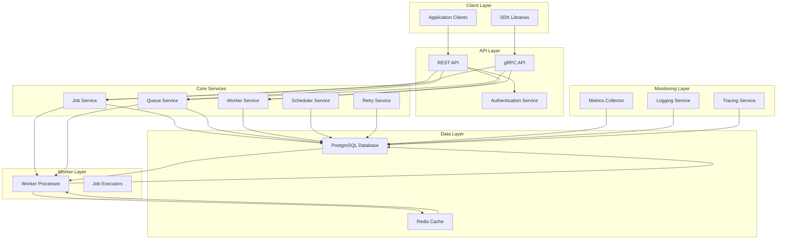

# TaskForge - High-Performance Background Job Queue System

TaskForge adalah platform SaaS background job queue berbasis Rust yang dirancang untuk memberikan keandalan dan kinerja tinggi, khususnya untuk bisnis yang proses latar belakangnya bersifat kritis (fintech, e-commerce, data processing).

## 🚀 Gambaran Umum

TaskForge menyediakan sistem queue dan eksekusi job yang andal dengan fokus pada:

- **Keandalan**: "Zero-Downtime, Zero-Memory-Leak" berkat jaminan keamanan memori dan konkurensi dari Rust
- **Kinerja**: Latensi ultra-rendah dan throughput tinggi (hingga ratusan ribu job per detik)
- **Developer Experience**: Dokumentasi API yang jelas, SDK untuk berbagai bahasa, dan dashboard observasi yang powerful

## ✨ Fitur Utama

### Job Management
- Submit job ke berbagai queue dengan berbagai prioritas
- Penjadwalan job (scheduled jobs) dengan dukungan ekspresi cron
- Ketergantungan antar job (Directed Acyclic Graph)
- Prioritas job (0-9)
- Job dengan penundaan (delayed jobs)
- Batch job submission

### Queue Management
- Pembuatan dan konfigurasi queue
- Penetapan prioritas queue
- Pengaturan batas retry dan timeout
- Pemantauan kesehatan queue
- Penyesuaian konfigurasi queue (max concurrent jobs, retry policies, dll.)

### Worker Management
- Pendaftaran worker dinamis
- Assignment queue-worker dengan bobot
- Heartbeat dan drain mode
- Auto-scaling berdasarkan beban
- Skala otomatis berdasarkan integrasi dengan cloud provider

### Sistem Keamanan
- Otentikasi JWT
- Otorisasi berbasis role dan permission
- Multi-tenant isolation
- Enkripsi data sensitif
- Rate limiting dan IP whitelisting

### Sistem Observability
- Logging terstruktur dalam format JSON
- Metrics sistem (Prometheus)
- Dashboard monitoring (Grafana)
- Tracing request end-to-end
- Alerting untuk kondisi kritis

## 🏗️ Arsitektur Sistem



## 🛠️ Teknologi yang Digunakan

- **Backend**: Rust dengan framework Axum dan runtime Tokio
- **Database**: PostgreSQL (utama), Redis (caching dan internal messaging)
- **Observability**: OpenTelemetry (tracing), Prometheus (metrics), Grafana (dashboard)
- **Security**: JWT untuk otentikasi, enkripsi data sensitif
- **Deployment**: Docker, Kubernetes

## 📋 Cara Kerja

### 1. Pengiriman Job
1. Client mengirim job ke API melalui endpoint `/jobs`
2. Job disimpan ke database dengan status `Pending`
3. Job ditambahkan ke antrian (queue) yang sesuai

### 2. Pemrosesan Job
1. Worker secara periodik mengecek antrian untuk job baru
2. Job dengan prioritas lebih tinggi diproses terlebih dahulu
3. Worker mengambil job dan mengubah status menjadi `Processing`

### 3. Eksekusi Job
1. Worker mengeksekusi job sesuai dengan jenisnya
2. Hasil eksekusi dicatat ke dalam database
3. Status job diperbarui menjadi `Succeeded` atau `Failed`

### 4. Penanganan Error dan Retry
1. Jika job gagal, sistem mengecek jumlah percobaan maksimum
2. Jika masih dalam batas, job dijadwalkan ulang dengan exponential backoff
3. Jika melebihi batas percobaan, job dipindahkan ke dead letter queue

## 🔧 Instalasi dan Penggunaan

### Prasyarat
- Rust 1.70+
- PostgreSQL 14+
- Redis 6+

### Instalasi Lokal
```bash
# Clone repository
git clone https://github.com/taskforge/taskforge.git
cd taskforge

# Install dependensi
cargo build

# Konfigurasi environment
cp .env.example .env
# Edit .env sesuai kebutuhan

# Jalankan migrasi database
cargo run --bin migrate

# Jalankan aplikasi
cargo run
```

### Docker Deployment
```bash
# Build dan jalankan dengan Docker Compose
docker-compose up --build
```

### Contoh Penggunaan API
```bash
# Submit job baru
curl -X POST http://localhost:8000/api/v1/jobs \
  -H "Authorization: Bearer YOUR_JWT_TOKEN" \
  -H "Content-Type: application/json" \
  -d '{
    "queue_name": "default",
    "job_type": "send_email",
    "payload": {
      "to": "user@example.com",
      "subject": "Hello",
      "body": "This is a test email"
    },
    "priority": 5
  }'
```

## 🧪 Testing

Sistem TaskForge dilengkapi dengan berbagai jenis testing:
- Unit testing untuk komponen individual
- Integration testing untuk interaksi antar layanan
- E2E testing untuk alur bisnis lengkap
- Property-based testing untuk edge cases
- Load testing untuk kinerja

Jalankan testing dengan:
```bash
# Unit dan integration tests
cargo test

# Property tests
cargo test --test property

# Load tests
cargo test --test load
```

## 📊 Monitoring dan Observability

TaskForge menyediakan berbagai metrik dan monitoring:
- Endpoint `/metrics` untuk Prometheus metrics
- Dashboard Grafana untuk visualisasi
- Logging terstruktur untuk debugging
- Tracing request end-to-end
- Alerting untuk kondisi kritis

## 🔐 Keamanan

- Multi-tenant isolation untuk memisahkan data organisasi
- JWT token untuk otentikasi
- Role-based access control (RBAC)
- Rate limiting untuk mencegah abuse
- Enkripsi data sensitif

## 🚀 Deployment

### Production Checklist
- [ ] Gunakan SSL/TLS untuk semua koneksi
- [ ] Konfigurasi backup database secara otomatis
- [ ] Setup monitoring dan alerting
- [ ] Konfigurasi rate limiting yang sesuai
- [ ] Setup auto-scaling untuk worker
- [ ] Konfigurasi audit logging
- [ ] Setup disaster recovery plan

### Docker Compose Production
```yaml
version: '3.8'
services:
  app:
    image: taskforge:latest
    environment:
      - DATABASE_URL=postgresql://user:password@db:5432/taskforge
      - REDIS_URL=redis://redis:6379
      - JWT_SECRET=your-super-secret-jwt-key
    ports:
      - "8000:8000"
    depends_on:
      - db
      - redis
    restart: unless-stopped

  db:
    image: postgres:14
    environment:
      - POSTGRES_DB=taskforge
      - POSTGRES_USER=taskforge_user
      - POSTGRES_PASSWORD=taskforge_password
    volumes:
      - postgres_data:/var/lib/postgresql/data
    restart: unless-stopped

  redis:
    image: redis:7-alpine
    restart: unless-stopped

volumes:
  postgres_data:
```

## 🤝 Kontribusi

Kontribusi sangat dihargai! Silakan fork repository ini dan buat pull request.

1. Fork repository
2. Buat branch fitur (`git checkout -b feature/amazing-feature`)
3. Commit perubahan (`git commit -m 'Add amazing feature'`)
4. Push ke branch (`git push origin feature/amazing-feature`)
5. Buat Pull Request

## 📄 Lisensi

TaskForge dilisensikan di bawah lisensi MIT - lihat file [LICENSE](LICENSE) untuk detail.

## 🆘 Dukungan

- Dokumentasi: [https://docs.taskforge.com](https://docs.taskforge.com)
- Forum Komunitas: [https://community.taskforge.com](https://community.taskforge.com)
- Email: support@taskforge.com

---

Dibangun dengan ❤️ oleh tim TaskForge